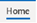

# About Us 

## Mission

Our Mission is to provide K-12 education and policy leaders in the
United States with relevant, accessible, valid, and reliable information
about the latest research so they can implement evidence-informed
practices that promote the physical, mental, and social well-being of
students, schools, and communities.

## Approach

To accomplish our mission, we conduct [evidence
syntheses](https://hedcoinstitute.uoregon.edu/what-we-do-what-evidence-synthesis),
which is the term for the systematic process of bringing together
information across all research answering a specific question. 

Systematically reviewing research evidence can require significant time
and resources, often taking over a year to complete. By using the latest
innovations and technologies in evidence synthesis methodology, the
HEDCO Institute can synthesize evidence to identify effective practices
when classrooms, schools, and districts need them most. Educators and
other decision-makers often don't have the time to wait for the results
from multi-year projects. Our process is designed to meet educators\'
decision-making timelines.

We also conduct what are termed "living reviews" on key topics. Living
reviews are systematic reviews that have new evidence added at regular
intervals, so that our findings stay up-to-date and include the latest
scientific research. The data from our systematic reviews are also
included in publicly available dashboards, so that interest-holders may
easily filter (e.g., by grade level or geographic region) and identify
data sources that may be relevant to them.

In addition to conducting our own evidence synthesis, we publish [blog
posts](https://hedcoinstitute.uoregon.edu/ask-hedco) written by HEDCO
Institute members or guest authors. We also highlight the evidence
synthesis work of others in translational products that summarize the
evidence in our [Evidence
Hub](https://hedcoinstitute.uoregon.edu/evidence-hub).

## Location

The HEDCO Institute is located in the HEDCO Education Building at:

HEDCO Institute
College of Education
6247 University of Oregon, Eugene, OR 97403-6247

**Offices**

The HEDCO Institute's home base is within the dean's office suite on the
second floor of the [HEDCO Education
Building](https://education.uoregon.edu/coe-campus-and-community).

**Parking**

There are a few options for parking near the HEDCO Institute:

1. Purchase a **UO visitor permit** which is \$5 for the day (it is
recommended to purchase the permit a couple days in advance as parking
can sell out) 

> a. Order Visitor Permit at the UO Parking Transportation Services
> [website](https://uoregon.aimsparking.com/). 
>
> b. Select "Visitor Permits" \> Select "Zone B Daily" \> Then, complete
> the order. 
>
> c.  This permit is valid for parking in \"Zone B\" which includes the
> parking lots outside the HEDCO Education Building (lots 17, 18 and
> 40).\" [map](https://mapapps.uoregon.edu/campusmaps/parkingmap.pdf)

2\. Purchase **hourly parking** for \$2 per hour: 

> a\. "Hourly Paid Parking" locations are noted in yellow on this
> [map](https://mapapps.uoregon.edu/campusmaps/parkingmap.pdf). 
>
> b. Hourly paid parking is available on a "first-come, first-serve"
> basis 
>
> c. Please see this
> [link](https://transportation.uoregon.edu/parking#envelope-468) for
> more info on hourly paid parking and what payment types are accepted. 

3.Look for **free public parking** on the street: 

> a. You can look for free street parking in the adjacent neighborhoods
> (which is typically 2-hour parking). b. Some of the closest options
> are on Hilyard St, E 17th Ave, E 16th Ave, East 15th Ave, and East
> 14th Ave which can be viewed on this
> [map](https://mapapps.uoregon.edu/campusmaps/parkingmap.pdf).

4\. Purchase longer-term parking (for people who are on campus
frequently):

> a\. [Commuter zone permits](https://transportation.uoregon.edu/zones)
> are for students and employees and can be purchased for a term, for 30
> days, or daily
>
> b\. Carpool permits can be shared between multiple people
>
> c\. [Reserved parking
> permits](https://transportation.uoregon.edu/reserved) may be available
> for people who need a guaranteed space, but they are limited in
> availability.

**Building Accessibility**

The HEDCO Education Building has gender neutral as well as
gender-specific restrooms. The building has stairs and an elevator.

##  Primary Contacts

<table>
  <tr>
    <td><strong>Jen Davis</strong> 
        <em>Executive Assistant</em> 
        Email: <a href="mailto:jdavis10@uoregon.edu">jdavis10@uoregon.edu</a> 
        Supports Dr. Emily Tanner-Smith and the HEDCO Institute, including its Undergraduate Scholars Program
    </td>
    <td><strong>Sean Grant, DPhil</strong> 
        <em>Research Associate Professor</em> 
        Email: <a href="mailto:spgrant@uoregon.edu">spgrant@uoregon.edu</a> 
        Directs the HEDCO Institute Undergraduate Scholars Program
    </td>
  </tr>
  <tr>
    <td colspan="2"><strong>Institute Email</strong>: <a href="mailto:hedcoinstitute@uoregon.edu">hedcoinstitute@uoregon.edu</a></td>
  </tr>
</table>

## Who we are

**Org Chart**

<table>
  <tr>
    <th style="width: 30%;">Title</th>
    <th style="width: 25%;">Name</th>
    <th style="width: 45%;">Bio/Directory Listing</th>
  </tr>

  <tr>
    <td>Executive Director</td>
    <td>Dr. Emily Tanner-Smith</td>
    <td><a href="https://education.uoregon.edu/directory/faculty/all/etanners">Emily Tanner-Smith | College of Education</a></td>
  </tr>

  <tr>
    <td>Executive Assistant</td>
    <td>Jen Davis</td>
    <td><a href="https://education.uoregon.edu/directory/faculty/all/jdavis10">Jen Davis | College of Education</a></td>
  </tr>

  <tr>
    <td>Digital Communications and Marketing Specialist</td>
    <td>Joe Golfen</td>
    <td><a href="https://education.uoregon.edu/directory/faculty/all/jgolfen">Joe Golfen | College of Education</a></td>
  </tr>

  <tr>
    <td>Research Associate Professor</td>
    <td>Dr. Sean Grant</td>
    <td><a href="https://education.uoregon.edu/directory/faculty/all/spgrant">Sean Grant | College of Education</a></td>
  </tr>

  <tr>
    <td>Research Assistant Professor</td>
    <td>Dr. Elizabeth Day</td>
    <td><a href="https://education.uoregon.edu/directory/faculty/all/eaday">Elizabeth Day | College of Education</a></td>
  </tr>

  <tr>
    <td>Research Associate</td>
    <td>Dr. Shaina Trevino</td>
    <td><a href="https://education.uoregon.edu/directory/faculty/all/strevino">Shaina Trevino | College of Education</a></td>
  </tr>

  <tr>
    <td>Postdoctoral Scholar</td>
    <td>Dr. Lisa Chinn</td>
    <td><a href="https://education.uoregon.edu/directory/faculty/all/lchinn1">Lisa Chinn | College of Education</a></td>
  </tr>

  <tr>
    <td>Senior Research Assistant</td>
    <td>Kasia Steinka-Fry</td>
    <td><a href="https://education.uoregon.edu/directory/faculty/all/ksteinka">Katarzyna Steinka-Fry | College of Education</a></td>
  </tr>
</table>

 
**Graduate students.** We are not currently accepting graduate students
to be primarily housed within the HEDCO Institute. However, our
director, Dr. Emily Tanner-Smith, does mentor doctoral students in the
College of Education. We may occasionally have part-time and/or hourly
research assistant positions that can be filled by graduate students. We
may also be able to collaborate with graduate students who are working
on evidence syntheses related to our topics of interest and interested
in pursuing research credits as part of their degree coursework. Contact
Dr. Sean Grant for inquiries related to collaborating with us.

## Mode of work

The HEDCO Institute is a hybrid team. Some of our staff are based in
Eugene whereas others work remotely from locations across the country.
Meetings usually occur via Zoom, and we send messages via email and
Teams (see [Section 3.2](#communication) for more on communication). We do have occasional
in-person meetings or events that include local and remote employees,
such as an annual retreat.

**Telecommuting**

-   Remote or hybrid employees must follow [UO guidance for remote
    work](https://hr.uoregon.edu/remote-work-arrangements-guidance)

-   Remote or hybrid employees need to have a [flexible work
    agreement](https://hr.uoregon.edu/flexible-work-agreement-form) on
    file that clarifies agreed upon work hours

-   Remote or hybrid employees are expected to have high-speed internet
    access, a professional background for video meetings, and a backup
    plan in the event of internet loss.

# Culture and Conduct

## Institute Culture

We are committed to an inclusive, safe, and supportive culture. We value
diversity, equity, and inclusion (DEI) and recognize that diversity
comes in many forms such as race, gender, sexuality, religion,
socioeconomic status, culture, ethnicity, country of origin, physical
appearance, political views, age, and disability status. The [College of
Education](https://education.uoregon.edu/diversity-equity-and-inclusion)
and larger University of Oregon also [support
DEI](https://inclusion.uoregon.edu/about-DEI) through various
initiatives.

As scientists, we value open communication and (friendly) debate. A safe
environment for such discourse must be built upon a foundation of
respect, so that people can feel comfortable sharing their ideas and
opinions. We believe that a culture in which people can share their
honest suggestions and ideas leads to more voices being heard and
faster/better scientific progress.

The SEIU Collective Bargaining Agreement (CBA) 2022-2026, Article 64
outlines the tenants of mutual respect that we follow. While the CBA
applies to classified employees, mutual respect applies to everyone.
Behaviors that contribute to an intimidating, abusive or bullying work
environment, will not be tolerated: [Link to
CBA](https://hr.oregonstate.edu/sites/hr.oregonstate.edu/files/2022-03/seiu_cba_2022-2026.pdf)
(see pages 108-110 ). Employees are supposed to report behaviors to
their supervisor or an appropriate person within the supervisory chain.
Additional resources for reporting at the university level are listed in
[Section 9.1](#reporting-issues-or-seeking-help).

**Core values**

[Innovation:]{.underline} grow and create new approaches, learn from
challenges, adapt to change

[Collaborative:]{.underline} nurture a sense of collegiality, engage
with internal and outside interest-holders, and invest in the
overall success of the institute

[Respect:]{.underline} engage in interactions that foster trust and
positive relationships

[Excellence:]{.underline} commit to growth and quality, engage in
continual improvement, focus on meaningful contributions, and exceed
our own expectations

[Integrity:]{.underline} be forthcoming and transparent, follow
through on commitments to colleagues and Institute partners

[Equity and inclusion:]{.underline} listen, learn, act; honor and
seek out diverse voices; be open to new and different approaches

## Communication

**Email:**

UO email is the primary mode of written communication and should always
be used for communication that needs to be documented/recorded/tracked.
Here is a link for [IT setting up your email
client](https://service.uoregon.edu/TDClient/2030/Portal/KB/?CategoryID=6247).

**Teams:**

We use Microsoft Teams for quick back & forth messages, sharing kudos,
and other general updates that do not need to be
documented/recorded/tracked. Think of using Teams for our inter-office
"messaging" or "chatting" -- this is typically used for things where you
need a quick reply/answer but don't need a formal email chain. Faculty
and staff may also request a Teams phone number if desired.

**Zoom:**

As a hybrid team, most of our meetings are conducted via Zoom. We prefer
to have cameras on when possible, but we understand that people may
sometimes have circumstances that require cameras to be off.

**Additional:**

-   Undergraduate scholars may also use Canvas to communicate with us
    (described further in [Section 7](#undergraduate-scholars-program)).

-   We do not typically use personal cell phone communications, such as
    calls or texts, unless necessary for particular circumstances or
    urgent issues. For example, we may communicate via cell phone if it
    is most convenient during retreat or conference travel, or if an
    issue requires an immediate response outside of traditional work
    hours.

**General Communication Etiquette**

We have members in most US time zones and with varying schedules.
Although we work hard, we also support work-life balance and respect
each other's time away from work. We try to be aware of each other's
time zones and we limit communications to members who are on leave.

**Email Communication Etiquette**

-   Emails may be sent at any time but, unless already discussed and
    planned, do not expect a reply outside of business hours in the
    recipient's time zone

-   If you are working after hours and wish to send an email, you may
    also use the scheduled send feature to send emails during the next
    business day

-   Most emails should be responded to within 1-2 business days

-   For emails that require a longer time for a full response, please
    acknowledge receipt of the email within 1-2 business days

-   We have a "3-email rule" where if an email requires more than 3 back
    and forths, we schedule a Zoom call instead

-   When sharing documents via email, we prefer OneDrive/Sharepoint
    links over email attachments

-   To get the format for a HEDCO Institute email signature, look at
    this [Sharepoint
    file](https://uoregon.sharepoint.com/:w:/s/O365_HEDCOInstitute/ESCHpgjYLhZGslKwYzQ8VFgBHoCsAfUCcwGaoEqgJ4qT-Q?CID=7BB8EED9-8E2E-42F1-8217-2D6491AD3F2C&wdLOR=c0185B66D-2E00-4623-A2CC-0C2264C2272D).

**Teams Communication Etiquette**

Teams messages are more commonly used for communication where you hope
for a quick reply. They should, therefore, be primarily used during both
parties' workday hours.

## Scheduling and Time Off

**Scheduling**

We use Outlook calendars for scheduling meetings, institute events, and
time off. Please block off busy and unavailable time that occurs during
your typical working hours on your individual UO Outlook calendar. You
do not need to share details when you put personal appointments on your
calendar, but please do block off unavailable time so that other members
know not to schedule meetings with you at those times. For example, you
may write "unavailable" or "appointment" instead of providing specific
details regarding a medical appointment.

Unavailable time of less than one working day (e.g., a brief
appointment) should be blocked off on individual employees' calendars.
Time off consisting of one full day or more should also be indicated on
the shared HEDCO Institute calendar.

**Calendar Setup**

To add the shared Institute calendar to your Outlook:

-   Select the calendar icon {width="0.3576388888888889in"
height="0.42430555555555555in"}

-   Select "Home" {width="0.38680555555555557in"
    height="0.23541666666666666in"}

-   Select "Browse Groups" (you may need to select
    {width="0.3021259842519685in"
    height="0.28128937007874016in"}at the far right for your screen for
    the "Browse Groups" option to show up)

-   Enter the name of the calendar "0365_HEDCO Institute" and select
    "Join"

**Time off**

We support work-life balance with time off to recharge, for family
reasons, to take care of health needs, etc. Most HEDCO staff have taken
vacation, sick days, parental leave, or bereavement leave. The HEDCO
Institute observes [university
holidays](https://hr.uoregon.edu/uo-holiday-observance) and university
policies for leave, paid time off, and sick days.

**PTO Norms**

-   To submit a request for PTO, email your supervisor for approval as
    soon as possible

-   For planned PTO that spans several days (e.g., vacation), consider
    sending your supervisor a calendar invite for the days you will be
    out

-   Please use out-of-office notifications if you are out of the office
    for more than one day and when you take PTO

    -   When on PTO for more than 1 day, always set an 'out of office'
        auto-response on your email that notifies people you are out of
        office and the date of your return. During times when an urgent
        email might come through, always list a backup contact person in
        your out of office response (and that backup contact should be
        notified in advance)

    -   For planned business travel, add dates to shared calendar and
        set an 'out of office' auto-response on your email

## Meetings

**Staff meetings**

We have weekly or biweekly all staff meetings on Zoom. Staff are invited
via Outlook calendar in advance, and meeting agendas are posted to the
Outlook calendar invite.

**Supervisor meetings**

Staff typically have weekly 1:1 meetings with their direct supervisor.

**Smaller team meetings**

Other teams also meet regularly or semi-regularly, including the
research team, communications team, and leadership team.

**Board meetings**

Advisory board meetings occur 3-4 times per year. They may occur in
virtual, in-person, or hybrid formats.

**Special meetings**

Because of our hybrid format, we make an effort to build in fun time
together, similar to what employees at traditional workplaces might
experience when they see each other "at the water cooler" or taking a
coffee or lunch break together. We have holiday gatherings and other
informal fun meetings occasionally on Zoom.

**Annual retreat**

Each fall, all employees typically get together in person for an annual
retreat. The retreat encompasses work-related activities (e.g.,
brainstorming sessions, discussing priorities for the upcoming year), as
well as meals or other fun outings.

## Dress Code

The dress code is business casual. UO sweatshirts and shirts are also
acceptable for informal meetings.

## Work Structure Norms {#work-structure-norms}

All employees are expected to be available and online during their
agreed upon work hours. Email and Teams should be regularly checked
during work hours. Employees are generally not expected to work on
nights or weekends or to check email or Teams outside of their agreed
upon work hours. Exceptions are infrequent circumstances when we might
have a tight deadline or special event.

# Technology and Research Resources

## IT Help {#it-help}

For IT help, you may [put in a
ticket](https://service.uoregon.edu/TDClient/2030/Portal/Requests/TicketRequests/NewForm?ID=zVTv9AZb5zc_&RequestorType=Service&ArticleId=131862)
or call the service desk at 541-346-7088. User Support Services (USS)
Academic South has two locations that you may visit in person if needed,
one at the Help Desk on the first floor of the Knight Library and one on
the first floor of the HEDCO Building (room 110).

## UO VPN {#uo-vpn}

The UO VPN can help you access resources from off campus that are
limited to campus networks only, such as Banner and certain library
resources. Many resources that we use do not require the VPN, including
email, Zoom, OneDrive, Canvas, DuckWeb, and Teams. You can find
instructions for using the VPN
[here](https://service.uoregon.edu/TDClient/2030/Portal/KB/ArticleDet?ID=31471#:~:text=Use%20UO%20VPN%20when%20you,Access%20to%20Electronic%20Resources%20page.).

## Printing {#printing}

You can be assigned a printing code and can print to
HEDCO-342-XEROX-7855 (3^rd^ floor workroom) or HEDCO-360-XEROX-7835
(closest to HEDCO Institute offices).

-   To connect your laptop to the printers, please visit the Learning
    Commons on the 1^st^ floor of the HEDCO Building or submit a ticket
    to the Help Desk via <https://service.uoregon.edu>

## Software {#software}

The University of Oregon provides some software for staff and students.
You can see what is available at: [Software Center \| UO Software
Downloads](https://software.uoregon.edu/software-center). HEDCO
Institute members often use common office software provided by UO,
including Microsoft Office Suite, Teams, and Zoom.

Some software that we use not provided by UO includes:

**R/RStudio.** The HEDCO Institute uses R to conduct most of its data
analyses. R and RStudio are free and open source.

**DistillerSR.** DistillerSR is a paid software that facilitates
reviews. It has options for duplicate removal, title, abstract, and
full-text screening, AI tools, reference labels, and more. DistillerSR
is used in a web browser, not downloaded. We have a paid license, and
HEDCO Institute staff will create an account for students and new staff
as needed.

**Zotero.** Zotero is the reference manager that we use for finding
full-texts of articles during reviews and for citations when writing
manuscripts. The HEDCO Institute has a Zotero library of references that
can be shared.

-   **Website to Download Zotero:** <https://www.zotero.org/>

-   **Zotero Instructions:** <https://researchguides.uoregon.edu/zotero>

-   **Zotero guides:**
    <https://www.zotero.org/support/quick_start_guide>

\*\*\*Access Lab Folder via Invitation

**Canva.** Canva is a design program for creating visually-appealing
briefs, reports, infographics, and a wide range of other written
products. There is a free version of Canva for anyone interested in
using it. The HEDCO Institute has paid licenses that offers access to
premium features.

**Accessibility**

Please reach out if you are facing accessibility challenges with any of
the software we use. We will work to find equivalent alternative options
or accommodations for individuals with visual impairments, impaired use
of their hands, etc. as needed.

## File Storage and Sharing {#file-storage-and-sharing}

**Storage**

All official Institute materials should be stored on the Institute
OneDrive/SharePoint (SP) site, (which can also be accessed via Teams).
Personal or working files can be stored on individual computers, but any
final versions of documents or materials should be stored on the
official institute SP site.

**Sharing**

When sharing files with other Institute employees, always share direct
links to the files on SP when possible (rather than sending email
attachments). When emailing other Institute employees about files, be
sure to include a link to the file location on SP (don't make the
recipient hunt down the file).

**Accessing OneDrive**

To access our shared files via OneDrive:

-   Follow the instructions on this webpage for installing OneDrive for
    Business on Windows
    <https://service.uoregon.edu/TDClient/2030/Portal/KB/ArticleDet?ID=33080>

-   Sync the HEDCO Institute OneDrive folder
    (https://uoregon.sharepoint.com/sites/O365_HEDCOInstitute/Shared%20Documents/Forms/AllItems.aspx)
    to your machine

-   This will allow you to sync all files directly to your machine, and
    it allows you to access all (sub)folders using File Explorer (just
    as you would to access a document stored on your desktop or hard
    drive)

-   This is the preferred method for editing documents, since accessing
    via web browser on O365 won't retain formatting well!

**Accessing Shared Files via Teams:**

-   Open Teams

-   Select the icon {width="0.33853127734033245in"
    height="0.4584284776902887in"}

-   Select the "Join or create team" button at the far right top of the
    page

-   Select "Join a team with a code" and enter the code provided in your
    orientation materials (see Jen Davis if you do not have this code)

-   You have now joined our Teams site: 0365_Hedco Institute

## Open Science {#open-science}

We strive to make our work replicable, open, and accessible to the
public. To accomplish this goal, we register our evidence synthesis
efforts and make these registrations publicly available on our Open
Science Framework (OSF) [page](https://osf.io/wqkjf/). Our OSF page also
links to our data analysis code on
[Github](https://github.com/HEDCO-Institute) and contains other
information such as publicly available technical reports and data
dashboards. Some of our projects also have publicly available
Interactive Data Dashboards on our website that allow individuals to
search and filter all studies included in one of our systematic reviews.
[Here is our
dashboard](https://hedcoinstitute.uoregon.edu/dashboards/depression-prevention-programs)
for Studies of School-Based Depression Prevention Programs as an
example.

**Some of our key open science and reproducibility strategies:**

-   Pre-Registration of Protocols and Coding Manuals

    -   All protocols and coding manuals are pre-registered on OSF
        before starting data collection or analysis

    -   Registrations are as detailed as possible, including aims, data
        sources, coding decisions, and planned analyses

-   Style Guidelines

    -   We use consistent folder structures, file structures, and file
        naming conventions across projects.

    -   Naming conventions should be both descriptive and consistent for
        discoverability and clarity

-   Coding Guidelines

    -   We primarily use R programming language

    -   Code is written with consistent commenting and formatting

    -   We use the {here} package to manage file paths, ensuring
        compatibility across systems

    -   Code includes clear documentation and a README with instructions
        for running the analysis

    -   We maintain stable computing environments (R/package versions)
        to support reproducibility

-   Code Repositories

    -   All analysis code is stored in structured GitHub repositories
        for version control and reproducibility

    -   We create an R project for each systematic review topic and publication
        organized with clear subfolders

        -   data -- contains data for our living review

        -   code -- contains code for our living reviews (analysis
            script)

        -   outputs -- contains outputs for our living reviews (tables,
            dashboards, etc.)

    -   Each GitHub project is linked to OSF, and each publication
        subfolder or project is associated with a specific data snapshot and
        separate component in OSF

-   Sharing Guidelines

    -   We follow [American Economic Association's
        guidance](https://aeadataeditor.github.io/aea-de-guidance/) for
        sharing a data and code replication package following
        computational reproducibility standards (e.g., clear
        documentation and a
        [README)](https://social-science-data-editors.github.io/template_README/)

    -   For living reviews, we maintain and update dashboards and
        documentation as needed to reflect new data

-   Public Reporting

    -   Publicly accessible research products are hosted on our HEDCO
        Institute website and OSF page

    -   Living technical reports are hosted on GitHub and updated as new
        data is available

    -   Dashboards are deployed through shinyapps.io and hosted on our
        website

# Publishing, Dissemination, and Authorship

## Research Products {#research-products}

We share the results of our research in multiple ways, most commonly in
various types of written products, data dashboards, and conference
presentations that may be local, national, or international. We
occasionally share our research in other ways, such as news interviews
and social media. The HEDCO Institute encourages trainees to pursue
publishing and research presentations.

**UO Student Presentations**

The UO has opportunities for undergraduates and graduate students to
present their research on campus. Students should also let us know with
as much advance notice as possible if they are interested in attending a
conference outside UO.

**Undergraduate Research Symposium**

-   <https://urds.uoregon.edu/symposium>

-   Students from all disciplines, majors, and colleges come together on
    campus to share the projects and interests they're passionate about.
    Students can present research, creative projects, data stories,
    works-in-progress, etc. in a variety of formats and media.

**Graduate Research Forum**

-   <https://graduatestudies.uoregon.edu/forum>

-   Graduate students can present at the Graduate Research Forum with a
    poster, three-minute thesis or as part of a panel.

**Poster Presentations**

The University of Oregon [Undergraduate Research and Distinguished
Scholarships](https://urds.uoregon.edu/symposium/poster) provides
information regarding poster printing on campus, as well as presentation
tips and other resources. They also provide PowerPoint poster templates.
Posters are typically made in PowerPoint but may also be designed using
other graphic software that can create .pdf files, such as Canva or
Adobe Illustrator.

**Translational Products**

One of our strengths is that we have a dedicated communications team
that helps us share our research or even the work of others with
non-research audiences. The [Evidence
Hub](https://hedcoinstitute.uoregon.edu/evidence-hub) on our website
contains summaries that help translate technical research into
accessible products for individuals involved in education.

**Conferences**

The conferences our members most often attend are:

American Educational Research Association

Society for Prevention Research

Society for Research on Educational Effectiveness

Society for Research Synthesis Methodology

## Authorship {#authorship}

We follow [ICMJE authorship
criteria](https://www.icmje.org/recommendations/browse/roles-and-responsibilities/defining-the-role-of-authors-and-contributors.html).
To be included as an author, an individual needs to make a substantive
intellectual contribution to a publication.

From the ICJME website:

*The ICMJE recommends that authorship be based on the following 4 criteria:*

-   *Substantial contributions to the conception or design of the work;
    or the acquisition, analysis, or interpretation of data for the
    work; AND*

-   *Drafting the work or reviewing it critically for important
    intellectual content; AND*

-   *Final approval of the version to be published; AND*

-   *Agreement to be accountable for all aspects of the work in ensuring
    that questions related to the accuracy or integrity of any part of
    the work are appropriately investigated and resolved*

**CRediT and Acknowledgments**

In addition to ICMJE criteria, we follow the [Contributor Role Taxonomy
(CRediT),](https://credit.niso.org/) which includes 14 roles that can be
used to describe contributions to a written product.

The 14 CRediT roles are:

> [Conceptualization](http://159.203.176.220/contributor-roles/conceptualization/)
>
> [Data
> curation](http://159.203.176.220/contributor-roles/data-curation/)
>
> [Formal
> analysis](http://159.203.176.220/contributor-roles/formal-analysis/)
>
> [Funding
> acquisition](http://159.203.176.220/contributor-roles/funding-acquisition/)
>
> [Investigation](http://159.203.176.220/contributor-roles/investigation/)
>
> [Methodology](http://159.203.176.220/contributor-roles/methodology/)
>
> [Project
> administration](http://159.203.176.220/contributor-roles/project-administration/)
>
> [Software](http://159.203.176.220/contributor-roles/software/)
>
> [Resources](http://159.203.176.220/contributor-roles/resources/)
>
> [Supervision](http://159.203.176.220/contributor-roles/supervision/)
>
> [Validation](http://159.203.176.220/contributor-roles/validation/)
>
> [Visualization](http://159.203.176.220/contributor-roles/visualization/)
>
> [Writing -- original
> draft](http://159.203.176.220/contributor-roles/writing-original-draft/)
>
> [Writing -- review &
> editing](http://159.203.176.220/contributor-roles/writing-review-editing/)

Individuals who contribute in a smaller or less direct capacity, such as
a board member who provides input on research topics, someone who does
minor proofreading but not substantial edits, or a librarian who helps
us find full-text articles, are generally not included as authors but
may be included in acknowledgments as warranted.

Specific publishing outlets, such as individual peer-reviewed journals,
may also have their own additional authorship guidelines that we must
follow.

**Author Order**

Author positions have meanings related to the amount of contributions
and/or roles that authors have on a project.

**First Author**. The project lead or person who did the most work on a
project will usually be the first author. The first author may be a
student or postdoc trainee if the trainee carried out most of the
research under faculty supervision and the trainee wrote a large portion
of the paper. The faculty supervisor on a project may be the first
author if a trainee carried out some of the research but the faculty
supervisor wrote most of the manuscript and/or designed the study. Ph.D.
students should be first author if they publish their dissertation.

**Last Author**. The last author is often the supervisor or the PI of
the grant funding for the project, or the senior author who has provided
overall leadership for the project. On many of our publications the last
author is the institute director, Dr. Emily Tanner-Smith, given her
overall leadership and senior guidance on all project activities and
outputs, or our research team director, Dr. Sean Grant, given his
research leadership on institute projects.

**Middle Authors**. Many of our publications also have middle authors
who made substantial contributions but did not lead the project. Middle
authors may include other contributors at the HEDCO Institute and
external collaborators in other UO departments or at other institutions.

**Corresponding Author**. The corresponding author is the person who
will be designated as the contact person for journal editors or readers
who have inquiries about a publication. The corresponding author is the
person who typically corresponds with the journal during the publication
process. This is often the first or last author.

## Use of Materials and Collaborations {#use-of-materials-and-collaborations}

Our data dashboards, protocols, and other resources are publicly
available. Anyone is welcome to use these, as long as they credit us
appropriately. For inquiries related to research collaborations with us,
contact Dr. Sean Grant (spgrant@uoregon.edu).

## Understand the Structure of a Research Study {#understand-the-structure-of-a-research-study}

A lot of journals and research articles use a conventional IMRD
structure, which include an abstract followed by *Introduction, Methods,
Results, and Discussion*. Some sections might use different names based
on the requirements of different journals. For example, Methods might be
named as Research Methods or Methodology. Except for the name
differences, each of these sections normally contains easily recognized
conventional features.

***[Abstracts]{.underline}***

Summary of the key points of the article. Read this first, but don't
rely on it solely to draw conclusions about the study.

Abstracts usually contain four kinds of information:

-   purpose or rationale of study (why they did it)
-   methodology (how they did it, who was studied)
-   results (what they found)
-   conclusion (what it means)

***[Introduction]{.underline}***

Introductions usually aim at generating readers' interest in the current
study and providing enough information to understand the current study.
This section usually provides readers the following information:

-   what is known about the topic-broad information
-   what is not known-more specific information
-   what question the authors asked and answered-a focal point

***[Methods]{.underline}***

This section provides you the approaches that were used in the study to
answer the research hypotheses. For example, the research instrument
used, (e.g. questionnaire), subjects (e.g. children between the ages of
8 and 15), procedures, and the approach to data analysis.

***[Results]{.underline}***

This section basically presents the data that the authors had found,
which might include the relationships among variables and/or differences
among groups are reported. These analyses should directly reflect the
predictions originally described in the Introduction.

***[Discussion]{.underline}***

This section provides a clear answer to the question posed in the
Introduction and to explain how the results support that conclusion.

**Questions to Consider**

***[Before and during your reading, consider the following
questions:]{.underline}***

-   What am I looking for?
-   Who are these authors?
-   What journal is this?
-   Might I question the credibility of the work?
-   Have I taken the time to understand all the terminology?
-   Have I gone back to read an article or review that would help me
    understand this work better?
-   Am I spending too much time reading the less important parts of this
    article?
-   Is there someone I can talk to about confusing parts of this
    article?

***[After reading, ask yourself these questions:]{.underline}***

-   What are the hypotheses of this study?
-   What specific problem does this research address?
-   Why is it important?
-   Is the method using a good one?
-   What are the specific findings?
-   Am I able to summarize them in one or two sentences?
-   Are the findings supported by persuasive evidence?
-   Is there an alternative interpretation of the data that the author
    did not address?
-   How are the findings unique/new/unusual or supportive of other work
    in the field?
-   How do these results relate to the work I'm interested in? To other
    work I've read about?
-   What are some of the specific applications of the ideas presented
    here?
-   What are some further experiments that would answer remaining
    questions?

**References**

Purugganan, M. & Hewitt J. (2004). How to read a scientific article.
Retrieved
from <http://www.owlnet.rice.edu/~cainproj/courses/HowToReadSciArticle.pdf>

Keshav, S. (2007). How to read a paper. *ACM SIGCOMM Computer
Communication Review*, *37*(3), 83-84.

How to read a scientific article (that you think is too complicated).
(n.d.). Retrieved from
 <https://www.engineering.pitt.edu/First-Year/First-Year-Conference/Documents/HowTo/>

# Funding and Grant Writing {#funding-grants}

The HEDCO Institute is primarily funded through donor gifts to the
College of Education. We also apply for competitive grants through
funding agencies such as the [National Science
Foundation](https://www.nsf.gov/) (NSF) and the [Institute of Education
Sciences](https://ies.ed.gov/) (IES). Our faculty and staff are
encouraged to apply for grants that align with their interests and our
mission. The University of Oregon provides information on [best
practices for grant
writing](https://research.uoregon.edu/plan/plan-project/proposal-development/best-practices-grant-writing-uo).

**Students**

Our undergraduate scholars are compensated through generous support of
donor gifts to the College of Education (see [Section 7](#undergraduate-scholars-program)). The College of
Education also has various [scholarships and funding
opportunities](https://education.uoregon.edu/admissions/scholarships-funding)
for students. At the university level, other financial resources are
available such as:

[The Office of Financial Aid and
Scholarship](https://financialaid.uoregon.edu/)

[Emergency Student
Loans](https://ba.uoregon.edu/student-financial-services/emergency-loans)

[The International Cultural Service
Program](https://isss.uoregon.edu/icsp)

[Graduate Student Assistance
Fund](https://graduatestudies.uoregon.edu/funding/special-assistance-funds/assistance-fund)

[Gender-Affirming
Support](https://dos.uoregon.edu/gender-affirming-support)**\
**

# Undergraduate Scholars Program {#undergraduate-scholars-program}

## Program Overview {#program-overview}

The HEDCO Institute Undergraduate Scholars Program (UGSP) is a
multidisciplinary program designed to support future generations of
educators, education researchers, and outreach and communication
specialists. Our program provides students with rigorous training in
research synthesis, effective evidence translation, and/or fostering
research-practice partnerships with the ultimate goal of increasing the
use of evidence-based practices in K-12 education.

**Specialty Areas**

Scholars in the program gain training and experience in three specialty
areas:

**Research Synthesis:** This specialty includes training in conducting
systematic reviews, meta-analyses, and other evidence reviews and
synthesis products to meet the decision-making needs of K-12 leaders.
Students will gain experience with prioritizing topics for evidence
reviews, conducting systematic literature reviews, collecting data for
systemic reviews, conducting statistical meta-analyses, writing up
results for publication in journals and presentations at conferences,
and other areas of research synthesis methodology.

**Knowledge Mobilization:** This specialty includes training in
translating evidence syntheses into digestible, easy-to-understand
products that are meaningful to educators (e.g., infographics, videos,
practice briefs, practice guides, toolkits). Students will gain
experience with co-creating evidence translation strategies, designing
translational research products, and developing dissemination plans for
various K-12 education audiences (e.g., teachers, principals,
superintendents, school district staff, policymakers).

**Interest-holder Engagement:** This specialty includes training in
applying strategies to identify, engage, and inspire K-12 education
interest-holders in using research to guide education practice and to
engage with the HEDCO Institute. Students will gain experience with
identifying relevant interest-holders, working with interest-holders to
guide the work of HEDCO Institute, as well as developing tools and
materials to support interest-holders' efforts to communicate and share
the work of the HEDCO Institute.

**Student Benefits:**

-   Receive a \$12,000 stipend to be distributed over the course of the
    calendar year.

-   Participate in professional development, scholarship, and research
    activities as a part of a prestigious cohort of top scholars.

-   Gain applied research experience and evidence translation skills
    that are crucial to be an effective educational research-practice
    partner.

-   IMPORTANT: If students are receiving federal financial aid, this
    award may affect financial aid eligibility. Students who receive
    federal aid have a responsibility to report all awards earned to the
    UO Office of Financial Aid and Scholarships. Contact [Financial Aid
    & Scholarships](https://financialaid.uoregon.edu) for more
    information.

**Eligibility Criteria:**

-   Sophomore or junior currently enrolled at the University of Oregon.
    -   Seniors who will graduate in December of the scholarship year or
        later are also eligible.
        

-   Preferred minimum 3.2 GPA\*.

-   Interest in research synthesis, knowledge mobilization, and/or
    interest-holder engagement related broadly to K-12 education.

-   Commitment to the program for four academic terms, including 10
    hours a week during the academic year and 15 hours a week in the
    summer.

**Program Expectations:**

Those selected to participate in the HEDCO Institute Undergraduate
Scholars Program are expected to:

-   Be a sophomore or junior currently enrolled at the University of
    Oregon (Seniors who will graduate in December of the program cohort
    year or later are also eligible).

-   Remain in "good academic standing" according to
    [advising.uoregon.edu/content/academic-standing](https://advising.uoregon.edu/content/academic-standing)
    throughout the year-long program.

-   Commit to the following schedule during the year, which includes
    regular meetings with your faculty mentor, participation in
    scheduled cohort and professional development meetings/activities,
    and completion of assigned trainings, activities/work, and projects:

    -   Winter term: 10 hours per week
    -   Spring term: 10 hours per week
    -   Summer term: 15 hours per week
    -   Fall term: 10 hours per week

-   Meetings generally occur over Zoom: Please display a professional
    work background for video meetings. The exceptions to the Zoom
    format include when HEDCO Institute faculty/staff are in Eugene for
    in person meetings/events and during occasional institute meetings
    in the HEDCO Education Building i.e., building orientation, in
    person meetings, etc.

-   Complete a final project determined by you and your mentor.

-   Acknowledge the HEDCO Institute Undergraduate Scholars Program in
    all work resulting from research during the program.

-   Notify the program administrator immediately of other support or of
    any conflicts with the eligibility and/or restrictions of this
    program.

-   Notify the program administrator of any publications or conference
    presentations that are associated with your work in the program.

-   The HEDCO Institute Undergraduate Scholars Program is a donor-funded
    program. In general, scholars can expect contact from the College of
    Education Development office for the following purposes:

    -   To request that you fill out a biographical survey (summer) and
        participate in professional photos (organized by the College of
        Education in the early fall) for the purposes of creating a
        scholar bio that will be sent to donors in later fall of the
        program cohort year. You will also receive a copy of the
        professional photo for your own use.

    -   Students will possibly be contacted for further engagement with
        donors and the Development team.

**Mentorship:**

Dr. Sean Grant is the faculty mentor for this program and will schedule
regular check ins with you throughout the program. Your faculty mentor
directs your specific program and is a resource for questions about the
trainings and work you will complete throughout the year. They can also
serve as a resource for questions related to career and/or graduate
school.

**Professional Development:**

You will be embedded on a professional team in the role of undergraduate
scholar. As a scholar, you will participate in targeted professional
development activities, such as:

-   trainings/modules on evidence synthesis, knowledge mobilization, and
    interest-holder outreach and engagement;

-   informational interviews with HEDCO Institute faculty and staff;

-   professional institute activities that occur during your program;
    and

-   panel discussions on selected topics (we focus on topics of interest
    to scholars, and depending on these interests, the panels can
    involve HEDCO Institute faculty/staff and/or professionals from the
    University of Oregon or the field of education where/when
    appropriate).

**University of Oregon (UO) Undergraduate Research Symposium:**

The University of Oregon holds the [Undergraduate Research
Symposium](https://urds.uoregon.edu/symposium) each spring to showcase
undergraduate research occurring across campus. Participation is open to
HEDCO Institute scholars but is entirely voluntary. Scholars complete
their program in December; those interested in presenting at the
symposium on their work resulting from the program would present the
following spring. Participants can present individually or as a cohort,
and the presentation format is flexible. HEDCO Institute faculty/staff
will support scholars interested in presenting at the symposium. Please
speak with your faculty mentor if you are interested in exploring this
opportunity further.

**Scholar Bio**

You will be asked to write a brief bio that HEDCO Institute staff can
share (with your permission). Examples of who we might share your bio
with: COE leadership/faculty/staff; donors; etc. Here is a basic
template:

-   Year in school (Example: "I am in my second year at the UO" or "I am
    a sophomore at the UO")
-   Major, minors
-   Career aspirations
-   "By participating in this program, [your first name here] hopes
    to..."

Note: This is different than the bio you will work on with the COE
Development Office this summer and fall.

**Resume Description:**

You will be provided with a resume description towards the end of your
program that you can include on a resume. For reference only, the resume
descriptions provided to 2023 and 2024 scholars is provided below

Please do not use the example descriptions below as they are not specific to your program. They are provided as examples only.

**[Resume Description Example]{.underline}**

**[2023 Cohort]{.underline}**

Undergraduate Scholar, HEDCO Institute for Evidence-Based Educational
Practice, College of Education, University of Oregon

January 2023-December 2023

Advisor:

**Responsibilities:**

Conducted a scoping review on a topic of national interest to educators:
screened studies and extracted data; contributed to academic
publications; contributed to the translation of research evidence into
practical information; participated in outreach and marketing
activities; and authored a blog post for the website (final project).

**Publication Citation:**

Grant, S., Trevino, S., Schweer-Collins, M., Day, E., Golfen, J.,
Steinka-Fry, K., & Tanner-Smith, E. (2023, November 5). Four-Day School
Week at Primary and Secondary Schools in the United States.
<https://doi.org/10.17605/OSF.IO/KQYC6>

Day, E., Golfen, J., Shimmel, L., Trevino, S., Grant., S., Steinka-Fry,
K., Cabrera, B., Hamilton, S., Martinez, S., & Tanner-Smith, E. (2023).
What research exists on four-day weeks in K-12 schools? HEDCO Institute
for Evidence-Based Educational Practice. Retrieved from
<https://hedcoinstitute.uoregon.edu/reports/four-day-school-week-scoping-review>

**[Resume Description Example]{.underline}**

**[2024 Cohort]{.underline}**

Undergraduate Scholar, HEDCO Institute for Evidence-Based Educational
Practice, College of Education, University of Oregon

January 2024-December 2024

Advisor:

**Responsibilities:**

Scholars conducted additional coding of primary studies from a HEDCO
Institute systematic review on school-based [depression prevention
programs](https://hedcoinstitute.uoregon.edu/reports/depression-prevention-review);
tested and used a supplementary coding tool to screen, extract and code
demographic data using literature review software (DistillerSR); and
contributed to the translation of research evidence into practical
information for education stakeholders.

## Operational Information for Incoming and Current Scholars {#operational-information-for-incoming-and-current-scholars}

**Mode of work:**

Like our staff, scholars are welcome to work in person, remotely, or a
mix of the two.

**Stipend:**

-   You will receive a \$12,000 total stipend (\$3K/term) over the
    course of the program. Here are details on the distribution of the
    funds:

    -   The funds, disbursed by Financial Aid & Scholarships, are
        distributed towards the beginning of each term and equally over
        the four terms (January -- December of your program year).

    -   Important: Please contact Jen Davis at jdavis10@uoregon.edu if
        the disbursements do not follow the schedule above.

    -   The award is designated as "research". This means the funds will
        go directly to you rather than being applied to any student
        account balance first.

    -   The funds will be disbursed however you have chosen to receive
        funds whether by check or direct deposit.

    -   The question, "Will my award be taxed?" is addressed in the
        [FAQs (Frequently Asked Questions)](#frequently-asked-questions-faqs) section of this
        manual.

    -   [Financial Aid &](https://financialaid.uoregon.edu)
        [Scholarships](https://financialaid.uoregon.edu), 541-346-3221

-   To set up direct deposit, log in to Duck Web \> Student Menu \>
    Direct Deposit: enter the info for "direct deposit" under "Employee
    Reimbursement and Student Account Refunds". Resources for adding
    direct deposit: [Business Affairs: Refunds and Direct
    Deposit](https://ba.uoregon.edu/student-financial-services/refunds-and-direct-deposit)
    and [Setting up Direct Deposit in
    DuckWeb](https://pages.uoregon.edu/baoforms/bao_drupal_6/sites/ba.uoregon.edu/files/directdepositinstr.pdf).
    Or, contact Student Billing at 541-346-3170 or
    <stubills@uoregon.edu>.

-   Important: If you are expecting to receive federal financial aid,
    this award may affect financial aid eligibility. Students who
    receive federal aid have a responsibility to report all awards to
    the UO Office of Financial Aid & Scholarships. Contact [Financial
    Aid & Scholarships for more
    i](https://financialaid.uoregon.edu/contact)nformation.

**Timeline:**

-   The program start date is the first Monday of Winter Term in January
    of the cohort calendar year.

-   The program end date is the last Friday of Fall Term in December of
    the cohort calendar year.

**Schedules:**

-   Hours by Week:

    -   Winter Term: 10 hours per week
    -   Spring Term: 10 hours per week
    -   Summer Term: 15 hours per week
    -   Fall Term: 10 hours per week

-   Meetings: Scholars participate in the following meetings:

    -   To start: weekly meetings
    -   As year progresses: fortnightly meetings
    -   Each term: Attend one staff meeting per term
    -   Starting Spring term, there may be smaller team meetings (e.g.,
        research team, outreach team, etc.)
    -   Throughout the year: regular check ins with your faculty mentor

-   You may find the following calendars helpful:

    -   [UO Five-Year
        Calendar](https://registrar.uoregon.edu/calendars/academic/five-year)
    -   [Time and Date
        Calendar](https://www.timeanddate.com/calendar/?country=1)
    -   [UO Holiday
        Observance](https://hr.uoregon.edu/uo-holiday-observance): The
        HEDCO Institute follows the UO Holiday Observance schedule.
        While our office is closed on UO holidays, scholars are still
        expected to complete their total required hours for that week.

**Communicating with us**

**Email**: You can expect to receive program information via email.
While Canvas will be your "go to" for files, calendar,
assignments/activities, etc., UO email will be used to facilitate
program administration such as scheduling.

**Teams**: You will use Teams for quick back & forth messages, sharing
kudos, and other general updates that do not need to be
documented/recorded/tracked. Think of using Teams for our inter-office
"messaging" or "chatting" -- this is typically used for things where you
need a quick reply/answer but don't need a formal email chain.

**Canvas**: All files, assignments/activities/projects, key dates
(calendar) are located on Canvas. There are two types of Canvas sites at
the UO:

-   Academic Instance (which you use for classes), and

-   Community Instance (which are for non-CRN courses and resources)

We will be using the Community Instance of Canvas for this program (see
image on the right below). The name of our Community Instance Canvas
site is "HEDCO Institute Undergraduate Scholars Program".

To log in to this site, please go to
[community.uoregon.edu](https://community.uoregon.edu/). You will login
using your Duck ID and password (similar to a Canvas course).

  

## Frequently Asked Questions (FAQs) {#frequently-asked-questions-faqs}

**1. Will my award be taxed?**

The UO (University of Oregon) does not remove taxes before distributing
the award to student accounts but does inform the IRS (Internal Revenue
Service) of the award. The UO completes a Form 1098-T:

-   Qualified tuition/fees paid by the student in box 1

-   Total scholarships received by the student (including this award) in
    box 5.

The student can consult a tax accountant regarding any tax implications
to be aware of as a result of receiving this award.

International students should check with Joy Germack, Senior Tax
Accountant/Analyst, <jgermack@uoregon.edu>, 541-346-0782, on possible
international tax implications.

Further questions about the Form 1098-T can be directed to Lara Grant,
Student Billing, <lkgrant@uoregon.edu>, 541-346-1086, for more info.

<https://www.irs.gov/forms-pubs/about-form-1098-t>

**2. Do I need to be enrolled in classes during summer term to receive
the stipend?**

No, you do not need to be enrolled in classes during the summer term to
receive the stipend. But, please let program staff know if you will not
be enrolled in summer classes as we must inform Financial Aid &
Scholarships in order for the stipend to be deposited into your account.

## Former Scholars {#former-scholars}

Former scholars are considered part of our team forever! Please feel
free to keep in touch with us, even if it has been a while. We like to
hear what you are up to, or to help where we can if you need anything.
We care about your success!

**Letters of Recommendation**

We are happy to write reference letters and serve as references for
former scholars, such as for grad school applications and job
applications (assuming appropriate conduct while you are with us).
Please request letters with as much advance notice as possible. When
possible, **we prefer at least 4 weeks of notice before a due date**. If
this amount of notice is not possible, please feel free to still ask us
and we will do our best. Please also **send us a reminder a week before
each letter is due**. If you are providing our contact info as a
reference on a job application, please let us know when you are working
on the application that somebody may be contacting us about the
position.

Information that can help us write the strongest letters includes:

-   A brief summary of the position or program you are applying for

-   Any instructions related to the letter (deadline, how to submit,
    etc.)

-   Your recent CV or resume

-   A brief reminder (a paragraph or a bulleted list) about your
    accomplishments with us and dates worked with us

-   Anything you want us to highlight in the letter specifically. We may
    highlight different things for positions, so please let us know if
    you have anything specifically in mind that you think we should
    include for each application, such as skills that were listed as
    desirable in a job listing.

[]{#_Toc187911711 .anchor}

## Appendices {#appendices}

### Appendix A: Acronyms: {#appendix-a}

COE: College of Education

PD: Professional Development

UGSP: Undergraduate Scholars Program

While not an acronym, [click
here](https://education.uoregon.edu/coe-campus-and-community) to find
out what HEDCO stands for.

### Appendix B: Definitions: {#appendix-b-definitions}

**Q: What is research synthesis?**

A. Research synthesis, or [evidence
synthesis](https://hedcoinstitute.uoregon.edu/what-we-do-what-evidence-synthesis),
is a term used to describe a variety of ways that researchers can
systematically summarize all of the research studies available to answer
a specific question. Research synthesis is an important and exciting
tool because it helps people working in a variety of fields (e.g.,
teachers, mental health clinicians, policymakers) make decisions based
on the entire body of evidence on a given topic.

**Q: What is knowledge mobilization?**

A: Knowledge mobilization is a term that includes a wide range of
activities used to make high-quality, research evidence about a
particular topic or issue accessible to the individuals and agencies who
can apply the information (e.g., school districts, teachers,
decision-makers). This may involve co-producing knowledge or co-creating
research products with non-researchers. Effective knowledge mobilization
is crucial for reducing the research-to-practice gap by helping
summarize research findings in a variety of ways and getting evidence
into the hands of education interest-holders. Working collaboratively
with stakeholders is a key piece to knowledge mobilization.

**Q: Who are interest-holders?**

A: An interest-holder is someone who has an interest in, or is affected
by, a given issue or topic. For example, there are many education
interest-holders. A teacher might be directly interested in how a
program delivered in the classroom promotes better student mental
health. A policymaker might be interested in that program because they
wonder if it is worth funding. A parent might be interested because they
want to know if that program will help their child. A student might be
interested because they want to know if the program will help them and
be enjoyable. Principals or educational leaders may be involved in
decisions about programs.

**Q: What is interest-holder engagement?**

A: Interest-holder engagement is a term used to describe the process of
identifying, motivating, and involving interest-holders in all steps
towards reaching a desired goal. This may include seeking input on which
research questions are most pressing to answer, as well as determining
how and who to tailor dissemination products to so they can have the
largest impact. By collaborating with interest-holders, we can tailor
our efforts and products to best meet the needs and desires of those
most affected by certain topics.

**Q: How is knowledge mobilization different from interest-holder
engagement?**

A: Both knowledge mobilization and interest-holder engagement are key
components to evidence translation. Knowledge mobilization involves
working with interest-holders to figure out how to effectively
communicate scientific results to various audiences. Thus,
interest-holder engagement is a critical element of effective knowledge
mobilization. On the other hand, interest-holder engagement involves a
wide range of strategies used to communicate directly with
interest-holders and guide them towards an innovative solution to their
problems. Depending on the goal of the interest-holders, this may not
always include knowledge mobilization.

# New Employee Information {#new-employee-information}

In addition to the HEDCO Institute requirement of reading this manual,
the University of Oregon requires certain forms and trainings for new
employees. Much of this can be found under the [New Employee Onboarding
Checklist](https://hr.uoregon.edu/new-employee-onboarding-checklist).

## Conflict of Interest {#conflict-of-interest}

The university is supportive of outside activities that advance the
mission of the university. If you participate in any outside activities
that may include a conflict of interest or conflict of commitment, you
are required to disclose these activities and you may need prior
approval from the university before engaging in these activities. Please
see [this
page](https://policies.uoregon.edu/vol-1-governance/ch-2-legal-affairs/conflict-interest-conflict-commitment-and-outside-activities)
for more information. Staff who have been with us for a while will need
to repeat the conflict of interest form if anything changes and each
calendar year. We recommend that you submit the form if you are at all
unsure whether an activity is exempt.

# Additional Resources {#additional-resources}

## Reporting Issues or Seeking Help {#reporting-issues-or-seeking-help}

We hope that you do not experience conflict, harassment, discrimination,
safety concerns, or inaccessibility at the University of Oregon in
general or the HEDCO Institute in particular. If you do experience
issues or concerns, your HEDCO supervisor may be able to help directly
or to assist you in finding help. (Note that we are mandatory reporters
of [child abuse and
neglect](https://hr.uoregon.edu/mandatory-reporting-child-abuse-and-neglect),
as well as some [other types of
disclosures](https://investigations.uoregon.edu/list-designated-reporters).)
If you would like to seek help outside of the HEDCO Institute or need to
report something at the university level, here are some university
resources for students and/or employees:

**Emergencies**: Call 911

**Reporting a physical access barrier on campus**: [Report a Physical
Access Barrier \| Investigations and Civil Rights
Compliance](https://investigations.uoregon.edu/report-physical-access-barrier)

**Getting support for harassment or discrimination**: [How to Get
Support \| Investigations and Civil Rights
Compliance](https://investigations.uoregon.edu/how-get-support)

**Getting a safety escort on campus**: [Safety Escorts \| Police
Department](https://police.uoregon.edu/safety-escorts)

**Free safe nighttime transportation on campus**: [Duck Rides \|
Transportation Services](https://transportation.uoregon.edu/rides)

**Ombuds Program (a resource for support and problem-solving)**: [Ombuds
Program \| University of Oregon](https://ombuds.uoregon.edu/)

**Counseling Services for students**: [UO Counseling
Services](https://counseling.uoregon.edu/)

**Campus police**: [Police Department \| University of
Oregon](https://police.uoregon.edu/). Non-Emergency and all other
business: 541-346-2919 (24 hours UOPD dispatchers).

## Miscellaneous Resources {#miscellaneous-resources}

[UO resources for caregivers](https://www.uoregon.edu/caregivers)

[UO public listservs](https://lists.uoregon.edu/mailman/listinfo)

[UO families listserv
sign-up](https://lists.uoregon.edu/mailman/listinfo/uofamilies)

[Division of Graduate Studies -
Postdocs](https://graduatestudies.uoregon.edu/postdoc)

[College of Education Governance](https://coedocs.uoregon.edu/policies/)
(must be on UO's VPN to access this site)

[UO Faculty Promotion
Guidance](https://provost.uoregon.edu/academic-personnel)

[ ]{.underline}[Academic
Impressions](https://provost.uoregon.edu/academic-impressions)

[LinkedIn Learning](https://hr.uoregon.edu/linkedin-learning)
